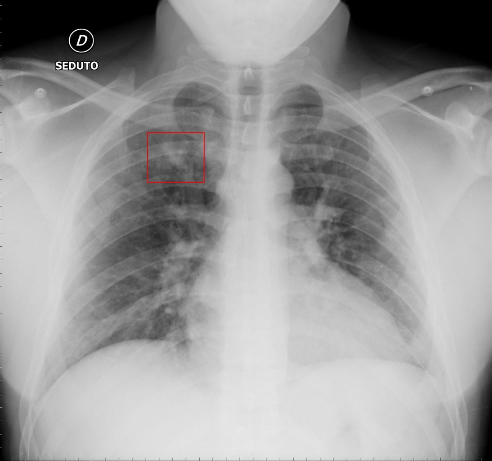
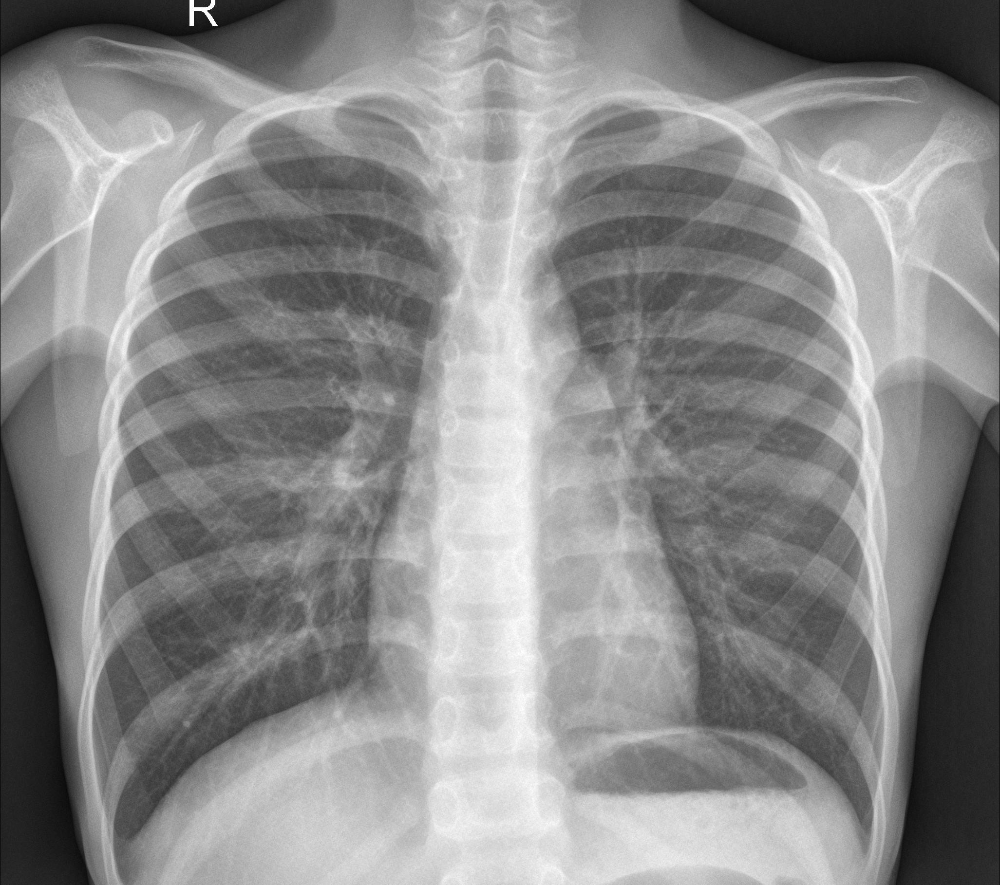

# COVID-19 Detection using CNN & Transfer Learning

This project implements a deep learning model to classify chest CXR images into three categories: **COVID-19**, **Normal**, and **Virus**. Two distinct approaches are explored and compared:

1.  Building a **Convolutional Neural Network (CNN)**.
2.  Implementing **Transfer Learning** using the pre-trained **MobileNet** model.

---

## Sample Data

Below is a sample image from each class within the dataset:

|           COVID-19           |           Normal            |                Virus                |
| :--------------------------: | :-------------------------: | :---------------------------------: |
|  |  | .jpeg) |

---

## Dataset

The dataset used for this project consists of chest CXR images across the three specified classes (`covid`, `normal`, and `virus` folders) and was sourced from Kaggle.

- **Dataset Source:** [COVID CXR Image Dataset](https://www.kaggle.com/datasets/sid321axn/covid-cxr-image-dataset-research/data)

To run this project, the `archive.zip` file from the link above was downloaded, renamed to `dataset.zip`, and placed in the project's root directory. The notebook script handles the unzipping process automatically.

---

## Requirements

To run this project, you'll need to have the following Python libraries installed. You can install them using pip:

```bash
pip install tensorflow opencv-python scikit-learn numpy pandas matplotlib
```

Note: It's highly recommended to use a virtual environment to keep project dependencies isolated.

---

## How to Run

1.  **Clone the repository:**

    ```bash
    git clone https://github.com/ErfanRezaei/COVID-19-Detection-using-CNN-Transfer-Learning
    cd COVID-19 Detection using Transfer Learning
    ```

2.  **Download the dataset:**
    Download the dataset from the [Kaggle link](https://www.kaggle.com/datasets/sid321axn/covid-cxr-image-dataset-research/data). Place the downloaded zip file in the root of the project directory and rename it to `dataset.zip`.

3.  **Open the Jupyter Notebook:**
    Launch Jupyter Notebook or Jupyter Lab and open the `COVID-19 Detection.ipynb` file.

4.  **Run the cells:**
    Execute the notebook cells sequentially. The script will automatically unzip the dataset, preprocess the images, build the models, and start the training and evaluation process.
